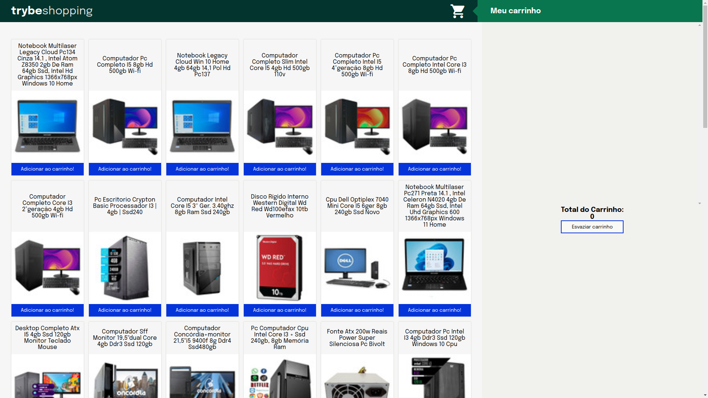

# Projeto Shopping Cart - Carrinho de Compras Dinâmico

## Projeto Final


## Descrição do Projeto

Projeto desenvolvido durante meu aprendizado no curso de Desenvolvimento Web da [Trybe](https://www.betrybe.com/) (Módulo: Front-end). <br>
Nesse projeto coloco em prática o que aprendi sobre JavaScript assíncrono, Fetch API, Async/Await, Jest — Testes Assíncronos.

O projeto Shopping Cart é uma aplicação que visa criar um carrinho de compras totalmente dinâmico, consumindo dados diretamente da API do Mercado Livre. Nesse projeto fazemos a busca pela categoria "computadores" e exibimos o resultado, mostrando imagem, nome e valor de cada produto.

## Funcionalidades

O projeto oferece as seguintes funcionalidades:

- Visualização dos produtos disponíveis no Mercado Livre (Categoria Computadores).
- Adição de produtos ao carrinho de compras.
- Remoção de produtos do carrinho de compras.
- Atualização automática do valor total dos produtos no carrinho.

## Desenvolvimento

O projeto foi elaborado com base no Desenvolvimento Orientado a Testes (Test Driven Development — TDD), ou seja, realizamos testes antes de implementar as funções da aplicação, para assegurar a eficiência da função e prever possíveis falhas.

## Objetivos do projeto

### 1 - Desenvolver testes para cobrir 100% da função `fetchProducts`:

É testado se:
  
- `fetchProducts` é uma função;
- ao executar a função `fetchProducts` com o argumento `computador` se `fetch` foi chamada;
- ao chamar a função `fetchProducts` com o argumento `computador`, a função `fetch` utiliza o endpoint `https://api.mercadolibre.com/sites/MLB/search?q=computador`;
- o retorno da função `fetchProducts` com o argumento `computador` é uma estrutura de dados igual ao objeto `computadorSearch` (arquivo já criado);
- ao chamar a função `fetchProducts` sem argumento, retorna um erro com a mensagem: `You must provide an url`.

### 2 - Criar a listagem dos produtos:

- Implementação da função `fetchProducts`;
- É utilizado o endpoint `https://api.mercadolibre.com/sites/MLB/search?q=$QUERY`, onde o valor de `$QUERY` é obrigatoriamente o termo `computador`;
- É criado a função `createListProducts`, responsável por criar a lista de produtos;
- Utilizo a função `createProductItemElement()`(função já criada) para criar os componentes HTML referentes a um produto;

### 3 - Desenvolver testes para cobrir 100% da função `fetchItem`:

É testado se:

- `fetchItem` é uma função;
- ao executar a função `fetchItem` com o argumento do item `MLB1615760527` se `fetch` foi chamada;
- ao chamar a função `fetchItem` com o argumento do item `MLB1615760527`, a função `fetch` utiliza o endpoint `https://api.mercadolibre.com/items/MLB1615760527`;
- o retorno da função `fetchItem` com o argumento do item `MLB1615760527` é uma estrutura de dados igual ao objeto `item` (arquivo já criado).
- ao chamar a função `fetchItem` sem argumento, retorna um erro com a mensagem: `You must provide an url`.

### 4 - Adicionar o produto ao carrinho de compras:

- Implementação da função `fetchItem`;
- É utilizado o endpoint `https://api.mercadolibre.com/items/$ItemID`, onde o valor de `$ItemID` é o `id` do produto a ser buscado;
- É criado a função `createCartListProducts`, responsável por adicionar o produto no carrinho;
- Utilizo a função `createCartItemElement()`(função já criada) para criar os componentes HTML referentes um item do carrinho;

### 5 - Remover o item do carrinho de compras ao clicar nele:

- Implementação da função `cartItemClickListener`, responsável por adicionar um evento de clique no produto do carrinho para removê-lo;

### 6 - Desenvolver testes para cobrir 100% da função `saveCartItems`:

É testado se:

- ao executar a função `saveCartItems` com o argumento `<ol><li>Item</li></ol>`, o método `localStorage.setItem` foi chamado;
- ao executar a função `saveCartItems` com o argumento `<ol><li>Item</li></ol>`, o método `localStorage.setItem` é chamado com dois parâmetros, sendo o primeiro `cartItems` e o segundo sendo o valor passado como argumento para `saveCartItems`;

### 7 - Desenvolver testes para cobrir 100% da função `getSavedCartItems`:

É testado se:

- Ao executar a função `getSavedCartItems`, o método `localStorage.getItem` é chamado;
- ao executar a função `getSavedCartItems`, o método `localStorage.getItem` é chamado com o `cartItems` como parâmetro.

### 8 - Carregar o carrinho de compras através do `LocalStorage` ao iniciar a página:

- Implementação da função `saveCartItems`, responsável por adicionar o item no `localStorage` em uma chave chamada `cartItems`;
- Implementação da função `getSavedCartItems` responsável por retornar o item do `localStorage`.

### 9 - Calcular o valor total dos itens do carrinho de compras de forma assíncrona:

- Implementação da função `getSum` responsável por fazer a soma de todos os produtos que estão no carrinho.

### 10 - Implementar a lógica no botão `Esvaziar Carrinho` para limpar o carrinho de compras:

- Implementação da função `clearCart` responsável por remover todos os produtos que estão no carrinho.

### 11 - Adicionar um texto de `carregando` durante uma requisição à API:

- Implementação da função `createLoading` responsável criar o elemento que contem o texto `carregando`;
- Implementação da função `removeLoanding` responsável remover o elemento criado por `createLoading`;
- É implementado a lógica necessária para aparecer o elemento criado antes da função `createListProducts` fazer a requisição a API e logo após faz a remoção do elemento.

## Tecnologias Utilizadas

O projeto foi desenvolvido utilizando as seguintes tecnologias:
<p>
  
  
  
  
</p>


- HTML, CSS e JavaScript para a criação da interface do usuário.
- A API Fetch para realizar requisições à API do Mercado Livre.
- Jest para a criação e execução dos testes automatizados.

## Demostração do funcionamento do projeto


## Como Executar o Projeto

Para executar o projeto em sua máquina local, siga as etapas abaixo:

1. Clone este repositório:
```
git clone git@github.com:mtssantos96/project-shopping-cart.git
```
2. Acesse o diretório do projeto:
```
cd project-shopping-cart
```
3. Instale as dependências do projeto `npm install`;
4. Inicie o projeto clicando no botão `Go Live` da extensão `Live Server` em seu `VS-Code`.

## Contribuição

Se você quiser contribuir para o desenvolvimento deste projeto, sinta-se à vontade para fazer um fork do repositório e enviar suas sugestões por meio de pull requests. Todas as contribuições são bem-vindas!

## Nota

Esse é o protótipo do esperado do projeto (protótipo criado pela [Trybe](https://www.betrybe.com/)):


Esse era o projeto quando eu concluí os requisitos pedidos pelo curso:


E como é possível ver na sessão `Demostração do funcionamento do projeto` essa é a cara atual dele, implementei novas funcionalidades e fiz melhorias no código. Também fiz melhorias na parte estética, seguindo como padrão a paleta de cores do protótipo do projeto. Ainda planejo adicionar outras funções.

#Obrigado pela visita :blue_heart:
